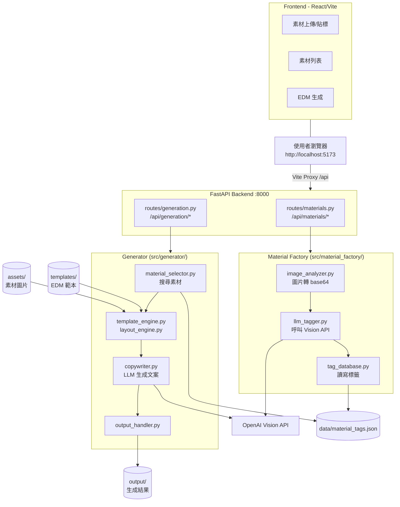

# 技術架構圖

```mermaid
flowchart TD
    Browser["使用者瀏覽器\nhttp://localhost:5173"]

    subgraph Frontend["Frontend - React/Vite"]
        UI_Upload["素材上傳/貼標"]
        UI_List["素材列表"]
        UI_Generate["EDM 生成"]
    end

    subgraph Backend["FastAPI Backend :8000"]
        R_Materials["routes/materials.py\n/api/materials/*"]
        R_Generation["routes/generation.py\n/api/generation/*"]
    end

    subgraph MaterialFactory["Material Factory (src/material_factory/)"]
        ImageAnalyzer["image_analyzer.py\n圖片轉 base64"]
        LLMTagger["llm_tagger.py\n呼叫 Vision API"]
        TagDatabase["tag_database.py\n讀寫標籤"]
    end

    subgraph Generator["Generator (src/generator/)"]
        MaterialSelector["material_selector.py\n搜尋素材"]
        TemplateEngine["template_engine.py\nlayout_engine.py"]
        Copywriter["copywriter.py\nLLM 生成文案"]
        OutputHandler["output_handler.py"]
    end

    OpenAI["OpenAI Vision API"]

    DB[("data/material_tags.json")]
    Assets[("assets/\n素材圖片")]
    Templates[("templates/\nEDM 範本")]
    Output[("output/\n生成結果")]

    Browser -->|"Vite Proxy /api"| Backend
    Frontend --- Browser

    R_Materials --> MaterialFactory
    R_Generation --> Generator

    ImageAnalyzer --> LLMTagger
    LLMTagger --> OpenAI
    LLMTagger --> TagDatabase
    TagDatabase --> DB

    MaterialSelector --> DB
    MaterialSelector --> TemplateEngine
    Templates --> TemplateEngine
    Assets --> TemplateEngine
    TemplateEngine --> Copywriter
    Copywriter --> OpenAI
    Copywriter --> OutputHandler
    OutputHandler --> Output
```
