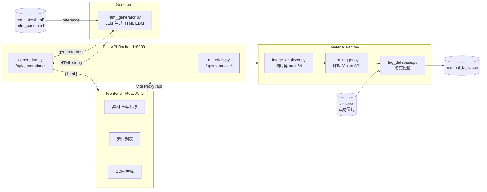

# 技術架構圖

```mermaid
flowchart LR
    subgraph Frontend["Frontend - React/Vite"]
        direction TB
        UI_Upload["素材上傳/貼標"]
        UI_List["素材列表"]
        UI_Generate["EDM 生成"]
        UI_Upload ~~~ UI_List ~~~ UI_Generate
    end

    subgraph Backend["FastAPI Backend :8000"]
        R_Materials["materials.py<br/>/api/materials/*"]
        R_Generation["generation.py<br/>/api/generation/*"]
    end

    subgraph MaterialFactory["Material Factory"]
        ImageAnalyzer["image_analyzer.py<br/>圖片轉 base64"]
        LLMTagger["llm_tagger.py<br/>呼叫 Vision API"]
        TagDatabase["tag_database.py<br/>讀寫標籤"]
    end

    subgraph Generator["Generator"]
        HTMLGenerator["html_generator.py<br/>LLM 生成 HTML EDM"]
    end

    DB[("material_tags.json")]
    Assets[("assets/<br/>素材圖片")]
    HTMLBase[("templates/html/<br/>edm_base.html")]

    Frontend -->|"Vite Proxy /api"| Backend

    R_Materials --> MaterialFactory
    R_Generation -->|"generate-html"| HTMLGenerator

    ImageAnalyzer --> LLMTagger
    LLMTagger --> TagDatabase
    TagDatabase --> DB
    Assets --> TagDatabase

    HTMLBase -->|"reference"| HTMLGenerator
    HTMLGenerator -->|"HTML string"| R_Generation
    R_Generation -->|"{ html }"| Frontend
```
