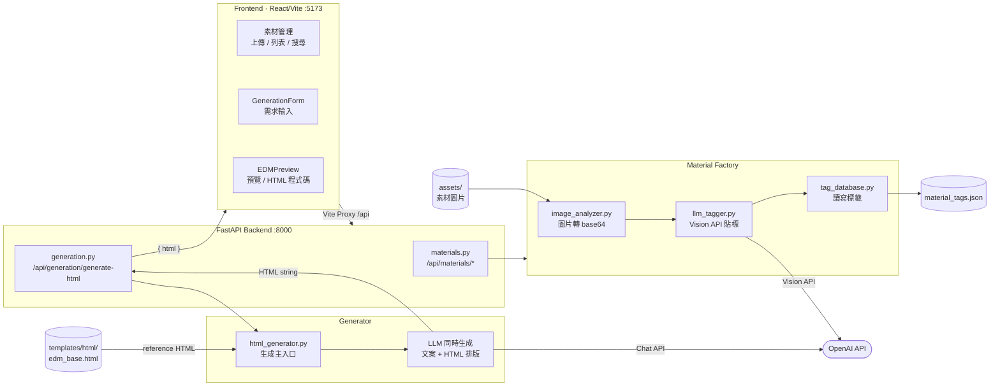

# 技術架構圖

```mermaid
flowchart LR
    subgraph Frontend["Frontend · React/Vite :5173"]
        direction TB
        UI_Mat["素材管理\n上傳 / 列表 / 搜尋"]
        UI_Form["GenerationForm\n需求輸入"]
        UI_Preview["EDMPreview\n預覽 / HTML 程式碼"]
        UI_Mat ~~~ UI_Form ~~~ UI_Preview
    end

    subgraph Backend["FastAPI Backend :8000"]
        R_Mat["materials.py\n/api/materials/*"]
        R_Gen["generation.py\n/api/generation/generate-html"]
    end

    subgraph MaterialFactory["Material Factory"]
        ImgAnalyzer["image_analyzer.py\n圖片轉 base64"]
        LLMTagger["llm_tagger.py\nVision API 貼標"]
        TagDB["tag_database.py\n讀寫標籤"]
    end

    subgraph Generator["Generator"]
        HTMLGen["html_generator.py\n生成主入口"]
        CopyLayout["LLM 同時生成\n文案 + HTML 排版"]
    end

    OpenAI(["OpenAI API"])
    DB[("material_tags.json")]
    BaseHTML[("templates/html/\nedm_base.html")]
    Assets[("assets/\n素材圖片")]

    Frontend -->|"Vite Proxy /api"| Backend

    R_Mat --> MaterialFactory
    Assets --> ImgAnalyzer
    ImgAnalyzer --> LLMTagger
    LLMTagger -->|"Vision API"| OpenAI
    LLMTagger --> TagDB
    TagDB --> DB

    R_Gen --> HTMLGen
    BaseHTML -->|"reference HTML"| HTMLGen
    HTMLGen --> CopyLayout
    CopyLayout -->|"Chat API"| OpenAI
    CopyLayout -->|"HTML string"| R_Gen
    R_Gen -->|"{ html }"| Frontend
```
