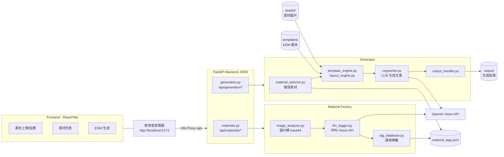

# 技術架構圖

```mermaid
flowchart LR
    Browser["使用者瀏覽器<br/>http://localhost:5173"]

    subgraph Frontend["Frontend - React/Vite"]
        UI_Upload["素材上傳/貼標"]
        UI_List["素材列表"]
        UI_Generate["EDM 生成"]
    end

    subgraph Backend["FastAPI Backend :8000"]
        R_Materials["materials.py<br/>/api/materials/*"]
        R_Generation["generation.py<br/>/api/generation/*"]
    end

    subgraph MaterialFactory["Material Factory"]
        ImageAnalyzer["image_analyzer.py<br/>圖片轉 base64"]
        LLMTagger["llm_tagger.py<br/>呼叫 Vision API"]
        TagDatabase["tag_database.py<br/>讀寫標籤"]
    end

    subgraph Generator["Generator"]
        MaterialSelector["material_selector.py<br/>搜尋素材"]
        TemplateEngine["template_engine.py<br/>layout_engine.py"]
        Copywriter["copywriter.py<br/>LLM 生成文案"]
        OutputHandler["output_handler.py"]
    end

    OpenAI["OpenAI Vision API"]

    DB[("material_tags.json")]
    Assets[("assets/<br/>素材圖片")]
    Templates[("templates/<br/>EDM 範本")]
    Output[("output/<br/>生成結果")]

    Browser -->|"Vite Proxy /api"| Backend
    Frontend --- Browser

    R_Materials --> MaterialFactory
    R_Generation --> Generator

    ImageAnalyzer --> LLMTagger
    LLMTagger --> OpenAI
    LLMTagger --> TagDatabase
    TagDatabase --> DB

    MaterialSelector --> DB
    MaterialSelector --> TemplateEngine
    Templates --> TemplateEngine
    Assets --> TemplateEngine
    TemplateEngine --> Copywriter
    Copywriter --> OpenAI
    Copywriter --> OutputHandler
    OutputHandler --> Output
```
