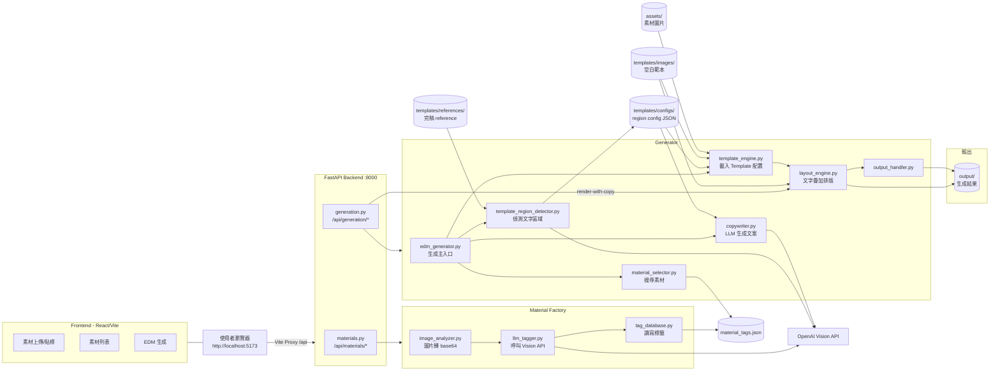

# 技術架構圖

```mermaid
flowchart LR
    Browser["使用者瀏覽器<br/>http://localhost:5173"]

    subgraph Frontend["Frontend - React/Vite"]
        UI_Upload["素材上傳/貼標"]
        UI_List["素材列表"]
        UI_Generate["EDM 生成"]
    end

    subgraph Backend["FastAPI Backend :8000"]
        R_Materials["materials.py<br/>/api/materials/*"]
        R_Generation["generation.py<br/>/api/generation/*"]
    end

    subgraph MaterialFactory["Material Factory"]
        ImageAnalyzer["image_analyzer.py<br/>圖片轉 base64"]
        LLMTagger["llm_tagger.py<br/>呼叫 Vision API"]
        TagDatabase["tag_database.py<br/>讀寫標籤"]
    end

    subgraph Generator["Generator"]
        EDMGenerator["edm_generator.py<br/>生成主入口"]
        MaterialSelector["material_selector.py<br/>搜尋素材"]
        RegionDetector["template_region_detector.py<br/>偵測文字區域"]
        TemplateEngine["template_engine.py<br/>載入 Template 配置"]
        LayoutEngine["layout_engine.py<br/>文字疊加排版"]
        Copywriter["copywriter.py<br/>LLM 生成文案"]
        OutputHandler["output_handler.py"]
    end

    OpenAI["OpenAI Vision API"]

    DB[("material_tags.json")]
    Assets[("assets/<br/>素材圖片")]
    TplImages[("templates/images/<br/>空白範本")]
    TplRefs[("templates/references/<br/>完稿 reference")]
    TplConfigs[("templates/configs/<br/>region config JSON")]

    subgraph OutputZone["輸出"]
        Output[("output/<br/>生成結果")]
    end

    Browser -->|"Vite Proxy /api"| Backend
    Frontend --- Browser

    R_Materials --> MaterialFactory
    R_Generation --> Generator
    R_Generation -->|"render-with-copy"| LayoutEngine

    ImageAnalyzer --> LLMTagger
    LLMTagger --> OpenAI
    LLMTagger --> TagDatabase
    TagDatabase --> DB

    EDMGenerator --> MaterialSelector
    EDMGenerator --> RegionDetector
    EDMGenerator --> Copywriter
    EDMGenerator --> TemplateEngine
    MaterialSelector --> DB
    TplRefs --> RegionDetector
    RegionDetector --> OpenAI
    RegionDetector --> TplConfigs
    TplConfigs --> Copywriter
    TplConfigs --> TemplateEngine
    Copywriter --> OpenAI
    TplImages --> TemplateEngine
    TplImages --> LayoutEngine
    Assets --> TemplateEngine
    TemplateEngine --> LayoutEngine
    LayoutEngine --> OutputHandler
    LayoutEngine --> Output
    OutputHandler --> Output
```
