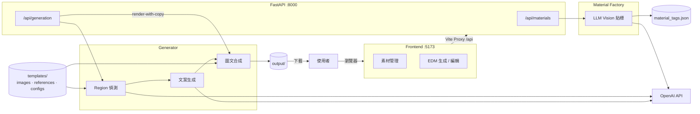

# 技術架構圖

```mermaid
flowchart LR
    User["使用者"]

    subgraph Frontend["Frontend :5173"]
        F1["素材管理"]
        F2["EDM 生成 / 編輯"]
    end

    subgraph API["FastAPI :8000"]
        A1["/api/materials"]
        A2["/api/generation"]
    end

    subgraph MF["Material Factory"]
        Tag["LLM Vision 貼標"]
    end

    subgraph Gen["Generator"]
        Detect["Region 偵測"] --> Copy["文案生成"] --> Render["圖文合成"]
    end

    OpenAI["OpenAI API"]
    DB[("material_tags.json")]
    Templates[("templates/\nimages · references · configs")]
    Output[("output/")]

    User -->|"瀏覽器"| Frontend
    Frontend -->|"Vite Proxy /api"| API

    A1 --> Tag
    Tag --> OpenAI
    Tag --> DB

    A2 --> Detect
    A2 -->|"render-with-copy"| Render
    Detect --> OpenAI
    Copy --> OpenAI
    Templates --> Detect
    Templates --> Render

    Render --> Output
    Output -->|"下載"| User
```
