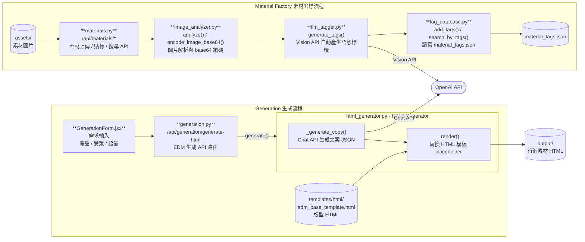

# 技術架構圖

```mermaid
flowchart LR
    subgraph Generation["Generation 生成流程"]
        direction LR

        GForm["**GenerationForm.jsx**\n需求輸入\n產品 / 受眾 / 語氣"]

        RGen["**generation.py**\n/api/generation/generate-html\nEDM 生成 API 路由"]

        subgraph HTMLGen["html_generator.py · HTMLGenerator"]
            direction LR
            GenCopy["_generate_copy()\nChat API 生成文案 JSON"]
            Render["_render()\n替換 HTML 模板 placeholder"]
            GenCopy --> Render
        end

        Template[("templates/html/\nedm_base_template.html\n版型 HTML")]

        GForm --> RGen
        RGen -->|"generate()"| HTMLGen
        Template --> Render
    end

    subgraph Material["Material Factory 素材貼標流程"]
        direction LR

        Assets[("assets/\n素材圖片")]

        UIMat["**materials.py**\n/api/materials/*\n素材上傳 / 貼標 / 搜尋 API"]

        ImgAn["**image_analyzer.py**\nanalyze() / encode_image_base64()\n圖片解析與 base64 編碼"]

        LLMTag["**llm_tagger.py**\ngenerate_tags()\nVision API 自動產生語意標籤"]

        TagDB["**tag_database.py**\nadd_tags() / search_by_tags()\n讀寫 material_tags.json"]

        DB[("material_tags.json")]

        Assets --> UIMat
        UIMat --> ImgAn
        ImgAn --> LLMTag
        LLMTag --> TagDB
        TagDB --> DB
    end

    Result[("output/\n行銷素材 HTML")]
    OpenAI(["OpenAI API"])

    Render --> Result
    GenCopy -->|"Chat API"| OpenAI
    LLMTag -->|"Vision API"| OpenAI
```
