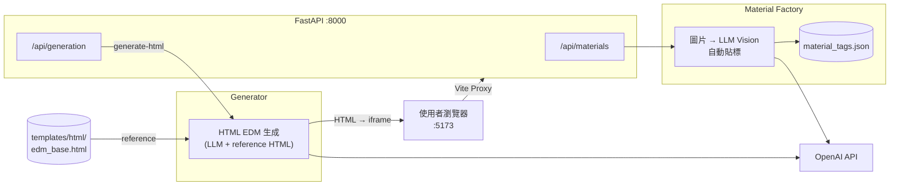

# 架構簡圖

```mermaid
flowchart LR
    User["使用者瀏覽器\n:5173"]

    subgraph Backend["FastAPI :8000"]
        API_Mat["/api/materials"]
        API_Gen["/api/generation"]
    end

    subgraph MaterialFactory["Material Factory"]
        Tagger["圖片 → LLM Vision\n自動貼標"]
        DB[("material_tags.json")]
        Tagger --> DB
    end

    subgraph Generator["Generator"]
        HTMLGen["HTML EDM 生成\n(LLM + reference HTML)"]
    end

    OpenAI["OpenAI API"]
    HTMLBase[("templates/html/\nedm_base.html")]

    User -->|"Vite Proxy"| Backend
    API_Mat --> Tagger
    Tagger --> OpenAI

    API_Gen -->|"generate-html"| HTMLGen
    HTMLBase -->|"reference"| HTMLGen
    HTMLGen --> OpenAI
    HTMLGen -->|"HTML → iframe"| User
```
