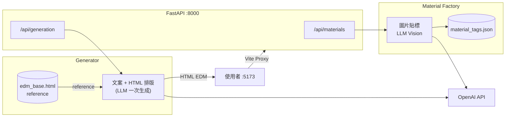

# 架構簡圖

```mermaid
flowchart LR
    User["使用者 :5173"]

    subgraph Backend["FastAPI :8000"]
        MatAPI["/api/materials"]
        GenAPI["/api/generation"]
    end

    subgraph MatPipeline["Material Factory"]
        Tagger["圖片貼標\nLLM Vision"]
        DB[("material_tags.json")]
        Tagger --> DB
    end

    subgraph GenPipeline["Generator"]
        Ref[("edm_base.html\nreference")]
        CopyHTML["文案 + HTML 排版\n(LLM 一次生成)"]
        Ref -->|"reference"| CopyHTML
    end

    OpenAI["OpenAI API"]

    User -->|"Vite Proxy"| Backend
    MatAPI --> Tagger
    Tagger --> OpenAI
    GenAPI --> CopyHTML
    CopyHTML --> OpenAI
    CopyHTML -->|"HTML EDM"| User
```
