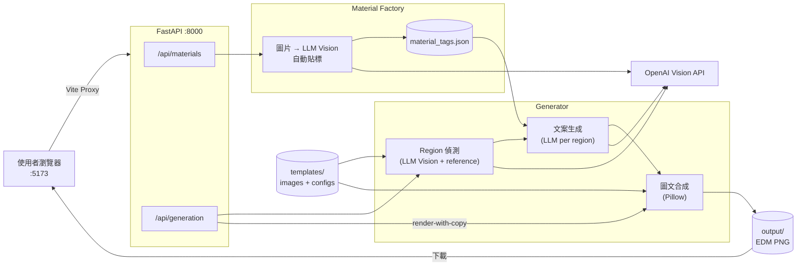

# 架構簡圖

```mermaid
flowchart LR
    User["使用者瀏覽器\n:5173"]

    subgraph Backend["FastAPI :8000"]
        API_Mat["/api/materials"]
        API_Gen["/api/generation"]
    end

    subgraph MaterialFactory["Material Factory"]
        Tagger["圖片 → LLM Vision\n自動貼標"]
        DB[("material_tags.json")]
        Tagger --> DB
    end

    subgraph Generator["Generator"]
        Detect["Region 偵測\n(LLM Vision + reference)"]
        Copy["文案生成\n(LLM per region)"]
        Render["圖文合成\n(Pillow)"]
        Detect --> Copy --> Render
    end

    OpenAI["OpenAI Vision API"]
    Templates[("templates/\nimages + configs")]
    Output[("output/\nEDM PNG")]

    User -->|"Vite Proxy"| Backend
    API_Mat --> Tagger
    Tagger --> OpenAI

    API_Gen --> Detect
    API_Gen -->|"render-with-copy"| Render
    Detect --> OpenAI
    Copy --> OpenAI
    Templates --> Detect
    Templates --> Render
    DB --> Copy
    Render --> Output
    Output -->|"下載"| User
```
