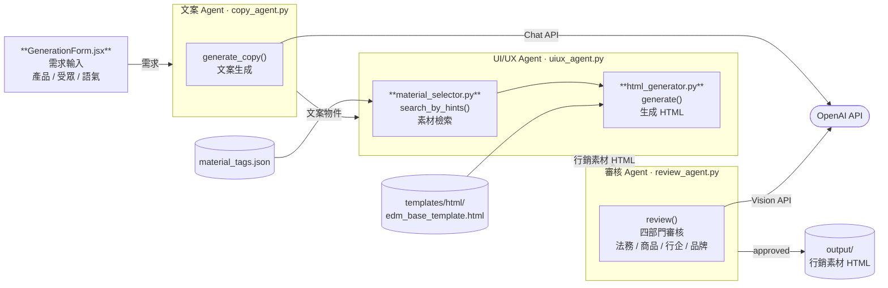
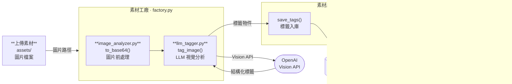

# Future Architecture — 三 Agent 行銷素材生產自動化

> AI 模擬真實單位工作流程：文案組 × 設計組 × 審核組

---

## 概念

將傳統行銷素材製作流程中的三個職能單位，各自對應一個 AI Agent，透過 orchestrator 串聯，實現從需求輸入到合規 EDM 輸出的全自動化生產線。



---

## Agent 一覽

### ① 文案 Agent（Copywriting Agent）

**角色**：模擬文案組，根據行銷需求產出所有文字素材

| 功能 | 說明 |
|------|------|
| 標題生成 | 依活動主題、受眾、訴求產出主標題與副標題 |
| 文案生成 | 生成 EDM body copy，字數符合版面限制 |
| CTA 設計 | 設計行動呼籲按鈕文案（立即購買／了解更多⋯） |
| 素材元件發想 | 建議需要哪些圖片素材（人物、產品、場景、圖示） |

**輸出**：結構化文案物件 `{ title, subtitle, body, cta, asset_hints[] }`

---

### ② UI/UX Agent

**角色**：模擬設計組，負責素材選取、排版與 HTML 輸出

| 功能 | 說明 |
|------|------|
| 素材檢索 | 根據文案 Agent 的 `asset_hints` 從素材庫語義搜尋圖片 |
| 素材個人化 | 依受眾、品牌色調篩選最適合的素材組合 |
| 生成 HTML | 套用 template，將文案 + 素材組合為完整 HTML EDM |
| 預覽圖展示 | 渲染 HTML 為截圖／縮圖，供審核 Agent 判讀 |

**輸入**：文案物件 + 素材庫
**輸出**：`output.html` + `preview.png`

---

### ③ 審核 Agent（Review Agent）

**角色**：模擬法務、商品、行銷企劃、品牌四個審核職能

| 功能 | 審核重點 |
|------|---------|
| 法務檢核 | 違禁詞、誇大不實、隱私政策合規 |
| 商品檢核 | 價格、規格、促銷條件是否與商品資料一致 |
| 行企檢核 | 活動期間、受眾定位、渠道策略是否符合計畫 |
| 品牌檢核 | 字體、配色、logo 使用是否符合品牌規範 |

**輸入**：HTML + 預覽圖 + 審核規則集
**輸出**：`{ approved: bool, issues: [], suggestions: [] }`

---

## 完整資料流

```
┌─────────────────────────────────────────────────────────┐
│                    使用者輸入                             │
│   { campaign, audience, tone, product_info, deadline }   │
└───────────────────────┬─────────────────────────────────┘
                        │
                        ▼
             ┌──────────────────┐
             │   Orchestrator   │
             └──────────────────┘
                        │
           ┌────────────▼────────────┐
           │      文案 Agent         │
           │  • 標題生成              │
           │  • 文案生成              │
           │  • CTA 設計             │
           │  • 素材元件發想          │
           └────────────┬────────────┘
                        │ 文案物件 + asset_hints
           ┌────────────▼────────────┐
           │      UI/UX Agent        │
           │  • 素材檢索              │
           │  • 素材個人化            │
           │  • 生成 HTML            │
           │  • 預覽圖展示            │
           └────────────┬────────────┘
                        │ HTML + preview.png
           ┌────────────▼────────────┐
           │      審核 Agent         │
           │  • 法務檢核             │
           │  • 商品檢核             │
           │  • 行企檢核             │
           │  • 品牌檢核             │
           └────────────┬────────────┘
                        │
               ┌────────┴────────┐
               │  approved?      │
               │                 │
              Yes               No
               │                 │
               ▼                 ▼
          輸出 EDM          回饋修改意見
                          └──► Orchestrator
                               重新執行相關 Agent
```

---

## Orchestrator 職責

- 管理三個 Agent 的執行順序（文案 → UI/UX → 審核）
- 傳遞跨 Agent 資料（避免每個 Agent 重複取用 context）
- 審核不通過時，根據 `issues` 判斷需要重跑哪個 Agent：
  - 文案問題 → 重跑文案 Agent（含後續）
  - 素材問題 → 重跑 UI/UX Agent（含後續）
  - 僅格式問題 → 僅重跑 UI/UX Agent 的 HTML 產出步驟
- 設定最大重試次數（預設 3 次），超出則回傳 human-in-the-loop 請求

---

## 與現有架構的對應

| 現有模組 | 對應 Agent |
|---------|-----------|
| `copywriter.py` | 文案 Agent 核心 |
| `material_selector.py` | UI/UX Agent — 素材檢索 |
| `html_generator.py` | UI/UX Agent — 生成 HTML |
| `edm_generator.py` | Orchestrator 雛型 |
| （待建） | 審核 Agent |

---

## 實作優先順序（建議）

1. **文案 Agent** — 現有 `copywriter.py` 已接近完整，包裝成 Agent 介面即可
2. **UI/UX Agent** — `material_selector` + `html_generator` 整合，加入預覽截圖能力
3. **Orchestrator** — 串聯上述兩者，定義 Agent 介面協議
4. **審核 Agent** — 建立規則集 + LLM judge，最後接入 loop

---

---

# Future Architecture — 素材工廠自動化

> AI 模擬真實素材管理流程：上傳 → 分析 → 貼標 → 入庫 → 搜尋

---

## 概念

素材工廠負責將原始圖片轉化為可被語義搜尋的結構化素材，是 EDM 生產線的上游準備階段。透過 LLM Vision 自動分析圖片，產生多維度標籤後存入素材庫，供下游 Generation Pipeline 檢索使用。



---

## 模組一覽

### ① 圖片分析（image_analyzer.py）

**職責**：將圖片轉為 LLM 可接受的格式

| 功能 | 說明 |
|------|------|
| Base64 編碼 | 讀取本地圖片，轉為 base64 字串 |
| 格式支援 | JPG、PNG、WebP |
| 路徑解析 | 根據 `ASSETS_DIR` 解析相對路徑 |

**輸出**：`{ base64_image, mime_type }`

---

### ② LLM 貼標（llm_tagger.py）

**職責**：呼叫 OpenAI Vision API，對圖片產生結構化多維標籤

| 標籤維度 | 說明 | 範例 |
|---------|------|------|
| `category` | 素材類型 | 人物、產品、場景、圖示 |
| `style` | 視覺風格 | 攝影、插畫、3D、扁平 |
| `context` | 使用情境 | 促銷、品牌形象、節慶 |
| `color_palette` | 主色系 | 暖色、冷色、中性、多彩 |
| `mood` | 情感氛圍 | 活潑、溫馨、專業、奢華 |
| `keywords` | 關鍵詞列表 | `["女性", "微笑", "戶外"]` |

**輸出**：結構化標籤物件

---

### ③ 素材庫管理（tag_database.py）

**職責**：讀寫 `data/material_tags.json`，提供 CRUD 與搜尋介面

| 功能 | 說明 |
|------|------|
| `save_tags()` | 新增或更新素材標籤記錄 |
| `search()` | 多條件過濾（類型 / 風格 / 情境 / 關鍵詞） |
| `get_all()` | 取得全部素材清單 |
| `delete()` | 刪除素材記錄 |

---

## 完整資料流

```
┌─────────────────────────────────────────────┐
│                  素材上傳                     │
│   assets/*.jpg / *.png / *.webp              │
└────────────────────┬────────────────────────┘
                     │
                     ▼
          ┌──────────────────┐
          │  image_analyzer  │
          │  • 讀取圖片      │
          │  • Base64 編碼   │
          └──────────┬───────┘
                     │ base64 + mime_type
                     ▼
          ┌──────────────────┐
          │   llm_tagger     │◄──── OpenAI Vision API
          │  • 視覺理解      │
          │  • 結構化貼標    │
          │  • 六維標籤產出  │
          └──────────┬───────┘
                     │ 標籤物件
                     ▼
          ┌──────────────────┐
          │   tag_database   │
          │  • save_tags()   │
          └──────────┬───────┘
                     │
                     ▼
          ┌──────────────────┐
          │material_tags.json│  ◄── 素材庫（單一 JSON）
          └──────────┬───────┘
                     │
                     ▼
          ┌──────────────────┐
          │   tag_database   │
          │  • search()      │
          └──────────┬───────┘
                     │ 符合條件的素材清單
                     ▼
          Generation Pipeline
          （UI/UX Agent 素材檢索階段）
```

---

## CLI 操作

```bash
source venv/bin/activate

# 單一檔案貼標
python cli.py tag --file assets/example.jpg

# 批次貼標（強制更新已有標籤）
python cli.py tag --dir assets/ --force

# 搜尋素材
python cli.py search --category 人物 --style 插畫

# 查看統計
python cli.py stats
```

---

## 與 Generation Pipeline 的銜接

| 素材工廠輸出 | Generation Pipeline 使用方 |
|-------------|--------------------------|
| `material_tags.json` | `material_selector.py` — `search_by_hints()` |
| 素材檔案路徑（`assets/`） | `html_generator.py` — 圖片 src 注入 |
